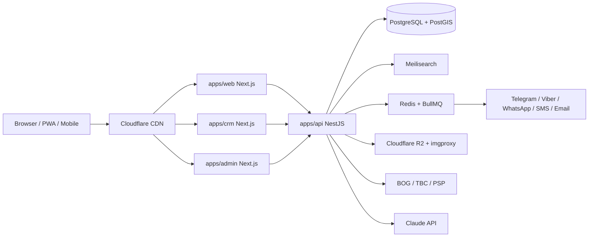

# Technical architecture



## Monorepo layout
```
apps/
  web/        public portal (SSR/ISR, SEO)
  crm/        broker workspace (PWA)
  admin/      moderation & settings
  api/        NestJS
  mobile/     (v2) Expo
packages/
  ui/         design system + Storybook
  contracts/  Zod schemas, DTO types, OpenAPI helpers
  db/         Drizzle schema, migrations, seeds
  ai/         Claude wrapper, prompts, eval fixtures
  config/     eslint, tsconfig, tailwind preset
infra/
  docker-compose.yml, Dockerfiles, GitHub Actions, deploy scripts
```

## Stack
| layer | tech | why |
|---|---|---|
| Frontend | Next.js (App Router, latest stable), TS, Tailwind, Radix | SSR/ISR — SEO is critical for listings |
| Backend | NestJS 11, TS | modular, DI, OpenAPI generated |
| DB | PostgreSQL 16 + PostGIS + pg_trgm | geo queries in-database |
| ORM | Drizzle | PostGIS support, typed SQL, fast migrations |
| Search | Meilisearch | typo tolerance, facets, geo, < 50 ms |
| Queue/cache | Redis 7 + BullMQ | notifications, liveness, images |
| Files | Cloudflare R2 + imgproxy | S3-compatible, cheap egress, resizing |
| Maps | MapLibre GL + MapTiler | custom style, much cheaper than Google |
| Auth | SMS OTP, Google, JWT + refresh | phone login is most convenient in Georgia |
| Payments | Bank of Georgia, TBC, own PSP | subscriptions, VIP, deposits |
| AI | Claude API | NL search, descriptions, location score |
| Infra | Docker, Hetzner or AWS eu-central-1, Cloudflare | EU datacenter, CDN, DDoS |
| Observability | Sentry, Grafana, OpenTelemetry | errors, metrics, tracing |

## NestJS modules
| module | responsibility |
|---|---|
| auth | login, OTP, tokens, roles, sessions |
| users | profiles, tenant profile |
| organizations | agencies, developers, teams, permissions |
| listings | listings, statuses, lifecycle state machine |
| passport | technical passport fields by business type |
| taxonomy | business types, filter configs, districts |
| media | photos, video, floor plans, 360°, processing jobs |
| geo | POI import, radius, insights, district stats |
| search | Meilisearch indexing, AI parser |
| alerts | saved searches, Telegram/Viber/email |
| liveness | confirmation scheduling and hiding |
| demand | demand board |
| offers | offers, negotiation, contract PDF |
| viewings | booking, availability, calendar sync |
| messaging | chat (WebSocket), unified inbox adapters |
| favorites | favorites, comparison, share links |
| stats | view/reveal/save events, daily aggregates, advice |
| services | services marketplace, quotes, orders |
| crm | contacts, deals, tasks, activities, sequences, matching |
| documents | templates, versions, e-sign |
| feeds | XML export |
| billing, payments | plans, subscriptions, invoices, bank webhooks |
| notifications | channel router, templates, preferences |
| ai | Claude calls via packages/ai |
| cms | permits checklist, static pages |
| admin, audit | moderation queue, settings, action log |
| v2: traffic, scoring, escrow, rent-payments, scans, public-api, property-mgmt, finance |

Listing lifecycle: `draft → pending_review → active ⇄ stale → rented|sold|archived`, `rejected` from review.

## Database schema (core)
All tables: `id uuid v7, created_at, updated_at, deleted_at`.
| table | key fields |
|---|---|
| users | phone, email, name, role, avatar_url, verified_at, locale |
| tenant_profiles | user_id, activity, experience_years, desired_term_months, about |
| organizations | name, slug, type (agency/developer), plan, logo_url |
| memberships | user_id, org_id, role |
| business_types | slug, name_ka, name_en, name_ru, filter_config jsonb, utility_coef |
| districts | city, name, geom multipolygon, avg_price_m2 |
| projects | org_id, name, address, completion_date, geom (off-plan buildings) |
| listings | org_id, owner_id, project_id, business_types[], deal_type, price_minor, currency, price_period, area_m2, floor, commission_pct, is_owner, status, last_confirmed_at, completion_date, geom, district_id, address, title, description (ka/en/ru), vip_until |
| space_passports | listing_id, power_kw, three_phase, ceiling_m, facade_m, width_m, depth_m, has_hood, has_gas, wet_points, gate_w_m, truck_access, access_24_7, parking, shop_window |
| listing_media | listing_id, kind (photo/video/plan/pano360), url, sort, is_floorplan |
| listing_history | listing_id, business_name, business_type, started_at, ended_at |
| transfer_equipment | listing_id, name, price_minor |
| availability_slots | listing_id, kind (viewing/short_term), starts_at, ends_at, price_minor |
| owner_verifications | listing_id, user_id, document_url, status, reviewed_by |
| liveness_checks | listing_id, sent_at, channel, token, confirmed_at |
| pois | category, name, geom, source, source_id |
| saved_searches | user_id, query jsonb, channels[], last_notified_at |
| demand_requests | user_id, business_type, area_min, area_max, budget_minor, districts[], expires_at |
| favorites, compare_lists | user_id, listing_id; id, user_id, listing_ids[], share_token |
| offers | listing_id, from_user_id, price_minor, term_months, free_months, status, parent_offer_id |
| viewings | listing_id, user_id, starts_at, mode (onsite/video), status, video_url |
| conversations, messages | listing_id, participants[], channel; conversation_id, sender_id, body, attachments, read_at |
| listing_events | listing_id, type (view/reveal/save/share), user_id, ip_hash, at |
| listing_stats_daily | listing_id, day, views, reveals, saves |
| service_providers, service_orders | user_id, categories[], profile; provider_id, requester_id, status, amount_minor, commission_minor |
| crm_contacts | org_id, type, name, phones[], emails[], tags[], source, requirements jsonb, owner_agent_id |
| crm_deals | org_id, contact_id, listing_id, stage, value_minor, commission_minor, agent_id, lost_reason |
| crm_pipelines | org_id, stages jsonb |
| crm_tasks | org_id, deal_id, contact_id, due_at, assignee_id, done_at |
| crm_activities | org_id, entity, entity_id, type, payload jsonb, created_by |
| crm_sequences, crm_sequence_runs | org_id, steps jsonb; sequence_id, contact_id, step, next_at |
| presentations | org_id, listing_ids[], token, opened_at |
| documents | org_id, deal_id, template, version, url, sign_status |
| co_broker_shares | listing_id, from_org_id, to_org_id, split_pct, status |
| plans, subscriptions, invoices, payments | plan config; org_id/user_id, plan, status, period_end; amount_minor, provider, provider_ref, status |
| settings | key, value jsonb (prices, launch_promo_until, liveness days) |
| cms_pages | slug, business_type_id, body_md, locale |
| audit_log | actor_id, org_id, action, entity, entity_id, diff jsonb, ip |
| v2 | traffic_samples, location_scores, escrow_accounts, rent_schedules, scans, api_keys, api_usage, maintenance_requests, finance_applications |

Indexes: GiST on all geom; GIN on business_types, tags; trigram on contact names and addresses; `(status, district_id, deal_type)` on listings. RLS on all `org_id` tables using `current_setting('app.org_id')` set per request.

## API (REST `/v1`, OpenAPI at `/v1/docs`)
| method | path | description |
|---|---|---|
| POST | /v1/auth/otp/request, /v1/auth/otp/verify | phone login |
| GET | /v1/listings | search with filters and radius |
| GET | /v1/listings/:id | listing with passport and analytics |
| POST/PATCH | /v1/listings, /v1/listings/:id | create/update |
| POST | /v1/listings/:id/confirm | liveness confirm (token) |
| POST | /v1/listings/:id/reveal-phone | rate-limited, logged |
| POST | /v1/search/parse | text → filters (AI) |
| GET | /v1/geo/insights | location analytics |
| GET | /v1/geo/districts/stats | price & vacancy map |
| CRUD | /v1/saved-searches, /v1/demand, /v1/favorites, /v1/compare | |
| POST | /v1/offers, /v1/offers/:id/counter | negotiation |
| POST | /v1/viewings | book viewing |
| WS | /v1/ws | chat, live notifications |
| GET | /v1/crm/deals | kanban |
| CRUD | /v1/crm/contacts, /tasks, /sequences, /presentations, /documents | |
| POST | /v1/crm/contacts/import | Excel import |
| GET | /v1/feeds/:orgId.xml | XML feed |
| POST | /v1/billing/checkout, /v1/payments/webhooks/:provider | payments |
| v2 | /v1/public/* (API key), /v1/escrow, /v1/rent-payments, /v1/scores | |

## Security & compliance
- Georgian Law on Personal Data Protection: phone numbers shown only after click; consent records; data export & delete endpoints.
- Rate limiting (per IP + per user) and bot protection (Cloudflare Turnstile) on reveal, OTP, contact forms.
- RLS isolates agencies; guard + integration test per org-owned resource.
- Webhook signature verification, idempotency keys on payments.
- Daily backups, 14-day point-in-time recovery; restore drill documented.
- Secrets via environment only; CSP, HSTS, secure cookies.
- SEO: SSR for public listings, schema.org (`Place`, `Offer`, `RealEstateListing`), sitemap index, landing pages per district × business type, canonical URLs.
- Performance: LCP < 2.5 s, Lighthouse ≥ 90.
